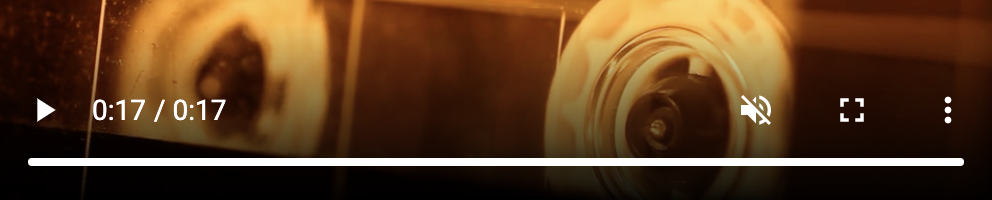
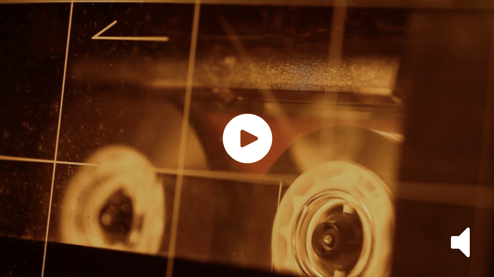
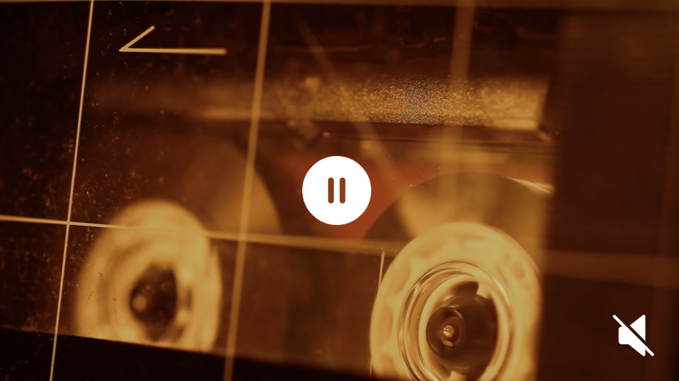

# Simple video controls

Sometimes design requires video to be without default controls (see below). For instance - if video is full screen background. Saying that - having simplictic controlled controls for such situations is also benefitial for UI. This helper function provides play/pause and mute toggle for any video tag. Function in written in ES5 and can be used without compilation. Supports IE11.



Default controls

End result after modification could look similar to :

|  Play + unmuted   |    Pause + muted    |        Visual         |
| :---------------: | :-----------------: | :-------------------: |
|  |  |  |


## Markup

There are no set structure for markup to allow flexibility. It is important to create required elements (all controls are optional) and pass DOM references to function.

Sample markup:

```html
<video id="video"  src="sample.mp4" type="video/mp4" poster="poster.png" autoplay muted> 
  <p>Your browser does not support this video.</p>
</video>
<button id="play">Play</button>
<button id="pause">Pause</button>
<button id="play">Mute/Unmute</button>
```

## Configuration

Function accepts two arguments : **options object** and **optional function** that will execute after video is ended. Markup assumed as per above.

```js
 const videoElement = document.getElementById('video');
  {
    classPrefix: 'video-', // optional DEFAULT: 'video-'
    stateHolder: videoElement, // optional DEFAULT: null
    video: videoElement, // mandatory ,
    playBtn: document.getElementById('play'), // optional DEFAULT: null
    pauseBtn: document.getElementById('pause'), // optional DEFAULT: null
    muteBtn: document.getElementById('mute'), // optional DEFAULT: null
    playClass: 'on', // optional DEFAULT: 'on'
    pauseClass: 'off', // optional DEFAULT: 'off'
    muteClass: 'muted', // optional DEFAULT: 'muted'
  },
  function () {
    console.log('video-ended');
  } // optional - executed when video is ended
```

### Legend

 - **classPrefix** - Substring that is added to playClass,pauseClass,muteClass
 - **stateHolder** - DOM element where class names are added depending on current video state
 - **video** - DOM element of video tag - This is only mandatory key
 - **playBtn** - If set - will assume play control
 - **pauseBtn** - If set - will assume pause control
 - **muteBtn** - If set - will assume mute toggle control
 - **Second** argument - Function. Useful if you want to perform action after video is ended. For example - watched video - Special offer modal pops up.
  
Default values are shown in configuration object as comments. play, pause and mute keys are all optional. if you are not using , for example, mute toggle - simply don't use the key.

### Return

Function returns destroy functionality. This means that if you can remove event listeners if video is hidden permanently.

Sample usage:

```js

  // First initialize and run
  const destroyVideo = controlVideo(
    {
      stateHolder: document.querySelector('.video-block'), // optional DEFAULT: null
      video: document.getElementById('video'), // mandatory ,
      playBtn: document.getElementById('v-play'), // optional DEFAULT: null
      pauseBtn: document.getElementById('v-pause'), // optional DEFAULT: null
      muteBtn: document.getElementById('v-mute'), // optional DEFAULT: null
    }
  );

  // Assign destroy and destroy
  const destroyBtn = document.getElementById('destroy');
  destroyBtn.addEventListener('click', destroyVideo, false);
```

## Initial state

Video state ( play or pause and mute) is checked on page load. This can save time on styling ( no default styling needed). play vs pause state is determined from present `autoplay` and `mute` attributes. Providing only `autoplay` will not work ( HTML5 videos will not autoplay unmuted videos )

## Usage

```js
const videoProps = {
    stateHolder: document.querySelector('.video-block'),
    video: document.getElementById('video'), 
    playBtn: document.getElementById('v-play'),
    pauseBtn: document.getElementById('v-pause'),
    muteBtn: document.getElementById('v-mute'),
}
controlVideo(videoProps);
```

## Quick use

1. Copy function ( app.js in this repository )
2. Build markup
3. Call function after HTML is rendered

Repository contains full example.